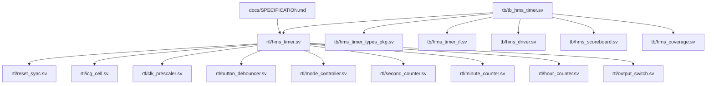

# Repository Map & Architecture Mapping (v2.3.0 Output Switch & Zero-Drift Clock)

## 1. Directory Structure

```text
HMS_Timer/
├── README.md                      # Overview, build instructions, test scorecard
├── Makefile                       # QuestaSim / VCS / Verilator build automation
├── repo_map.md                    # Repository mapping & traceability
├── rtl_hierarchy.md               # RTL Module hierarchy & port mapping
├── design_intent.md               # Architectural decisions & rationale
├── common_failures.md             # Common bugs and debugging playbook
├── debug_checklist.md             # Pre-commit & sign-off checklist
├── docs/
│   ├── SPECIFICATION.md           # Formal Top-down Architectural Specification (v2.3.0)
│   └── SPECIFICATION.docx         # Formatted Word Document with Architecture & Timing Diagrams
├── rtl/
│   ├── reset_sync.sv              # 2-Stage Asynchronous Assert, Synchronous Deassert Reset Synchronizer
│   ├── icg_cell.sv                # Glitch-Free Integrated Clock Gating (ICG) Cell
│   ├── clock_control_unit.sv      # Centralized Clock Management & Glitch-Free ICG Unit
│   ├── clk_prescaler.sv           # Multi-stage cascaded prescaler (1 MHz -> 1 kHz -> 1 Hz, PPA Optimized)
│   ├── button_debouncer.sv        # 100% 1 kHz Pure Clock 20ms ±10% debounce counter & auto-repeat (5-bit)
│   ├── button_controller.sv       # Multi-channel button controller & 1 MHz single-cycle pulse alignment
│   ├── mode_controller.sv         # 4-State Mode FSM with 5s Inactivity Timeout & Edit Buffer (ICG clocked)
│   ├── second_counter.sv          # Modulo-60 Second Background Counter with Synchronous Load (1 toggle/s)
│   ├── minute_counter.sv          # Modulo-60 Minute Background Counter with Synchronous Load (1 toggle/60s)
│   ├── hour_counter.sv            # Modulo-24 Hour Background Counter with Synchronous Load (1 toggle/3600s)
│   ├── output_switch.sv           # Combinational Display Multiplexer (Run: Counter / Adj: Buffer)
│   └── hms_timer.sv               # Top-Level IP Core Integration with CCU, Reset Synchronizer & Output Switch
└── tb/
    ├── hms_timer_types_pkg.sv     # Enums, structs, transaction classes, logging
    ├── hms_timer_if.sv            # SystemVerilog Interface with Clocking Blocks, ICG probes & SVA
    ├── hms_driver.sv              # Driver class for stimulus & reset
    ├── hms_scoreboard.sv          # Cycle-accurate Scoreboard & Golden Model
    ├── hms_coverage.sv            # Covergroups for FSM, Time values & Crosses
    └── tb_hms_timer.sv            # Main testbench runner executing automated test cases
```

## 2. File Responsibilities & Inter-dependencies


